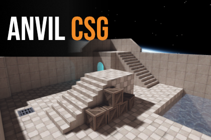

# Anvil CSG Beta 2

### Free Unity level design preview

Anvil CSG is a brush-based level editor inside Unity, inspired by Hammer and TrenchBroom. Draw your layout, shape the brushes, put some materials on, and build a map without leaving the editor.

I'm sharing Beta 2 so you can try the workflow while the newer release waits for its Asset Store review. This is an older build with known bugs, not the latest version being tested. It's free to use under the [preview licence](LICENSE.md), including in games with a **Made with AnvilCSG** credit.

**[Download Beta 2](https://github.com/TheGreatSimon/AnvilCSG/releases/download/beta-2/AnvilCSG-Beta2-Preview.zip)**

**Unity 6.3 only.** Updated September 25: fixed a bug that stopped Beta 2 projects from building a game. Download the updated package if you ran into build errors.

[Watch the tutorial](https://www.youtube.com/watch?v=B0sDldIkYYs) · [Join the Discord](https://discord.gg/ZjVdWnmwjz) · [Read the docs](https://2yeet.gitbook.io/anvilcsg)

## What you can try

- Build in top, front, side, and perspective views.
- Create boxes, wedges, cylinders, stairs, and arches.
- Shape brushes with clipping, carving, hollowing, and face, edge, and vertex tools.
- Paint materials, adjust texture alignment, and use texture lock.
- Organize a map with groups and layers, then generate map output.

## Before you download

**Beta 2 is an older preview with known bugs.** This update fixes the game-build bug; it does not add features or include the newer betas. Ongoing updates and compatibility with future releases are not promised.

Try it in a separate project first. Back up your work, and don't import it over another Anvil version. If you already have access to a newer beta, keep using that instead.

The tutorial and documentation may show a newer version. Some buttons, features, and steps will differ from Beta 2.

## Getting started

1. Download the ZIP above and extract it. Read the included licence and preview notes.
2. Open a separate Unity project. Import `Anvil21.unitypackage` through **Assets > Import Package > Custom Package**.
3. Open **Tools > Anvil > Workspace**.
4. Start with a small box in an orthographic view. Try shaping it and painting a material before building a larger map.
5. Use the workspace Help menu for controls and shortcuts. Run **Preflight** before **Build Map**.

The package also includes a demo scene at `Assets/Anvil/Demo/DemoScene.unity`.

## Compatibility and limitations

- Supports **Unity 6.3 only**, with **Built-in** or **URP**. Other Unity versions and HDRP are not supported for this preview.
- The bundled native xatlas lightmap UV plugin is for the **Windows x64 Unity Editor**. Do not assume that workflow will work on macOS or Linux.
- The game-build fix was verified with a Windows player build on **Unity 6000.3.10f1**.
- Later lighting, UV, selection, and placement fixes are not included. Check the result on a small map before relying on a workflow for a larger project.
- Support for integrations shown in newer Anvil videos is not promised for Beta 2.
- Keep backups of your editable scenes. Generated output is not a replacement for them.

## Can I use it in a game?

Yes, including a commercial game. Include **Made with AnvilCSG** in the game's credits or accompanying documentation. You can create, edit, and distribute your own levels and generated map content under the preview licence.

This is **not an open-source release**. Anvil's own code cannot be modified, repackaged, or sold. Third-party components keep their own licences. Please read [LICENSE.md](LICENSE.md) for the full terms and [THIRD-PARTY-NOTICES.txt](THIRD-PARTY-NOTICES.txt) for the included notices.

## What's next?

The newer paid release is planned for the Unity Asset Store at **$20**, with a **30% launch discount for the first two weeks ($14)**. Beta 2 does not include a licence or free upgrade to that release. There is no confirmed launch date yet.

I'll post release news on [Discord](https://discord.gg/ZjVdWnmwjz). You're welcome to share your maps there too. Beta 2 doesn't come with support, so please don't expect fixes for this old build.

If you enjoy Anvil, sharing this page with another level designer would help a lot. A star is appreciated too, but neither is required to download or use the preview.

Thanks for giving it a try. I'd love to see what you build.
